<h3><code>Vivekk936@github ~ $ whoami</code></h3>

<table>
<tr>
<td valign="top">

</td>
<td valign="top">

</td>
</tr>
</table>

 
 

<h3><code>Vivekk936@github ~ $ ./stats.sh</code></h3>

  
  

<h3>💫 Passionate About</h3>

  ✨ Turning ideas into something real &nbsp; • &nbsp;
  🤖 Exploring AI and new technology &nbsp; • &nbsp;
  🌐 Automating things that make life easier 
  

 
 

<h3><code>Vivekk936@github ~ $ ./contributions.sh</code></h3>

 
 

<h3><code>Vivekk936@github ~ $ ./links.sh</code></h3>

<b>B.Tech CSE Student · Programmer </b>

## 📊 GitHub Contribution Statistics

  

### 🔥 Contribution Stats

| 📈 Statistic           |                  🔢 Value |
| ---------------------- | ------------------------: |
| 🔥 Current Streak      | **Automatically updated** |
| 🏆 Longest Streak      | **Automatically updated** |
| 💻 Total Contributions | **Automatically updated** |

> These statistics are generated from my GitHub contribution activity and updated automatically using GitHub Actions.

### ⚡ Activity Overview

* 🔥 **Current Streak:** Updated automatically
* 🏆 **Longest Streak:** Updated automatically
* 📊 **Total Contributions:** Updated automatically
* 🗓️ **Contribution Heatmap:** Updated automatically

